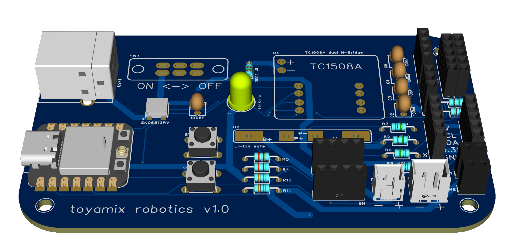
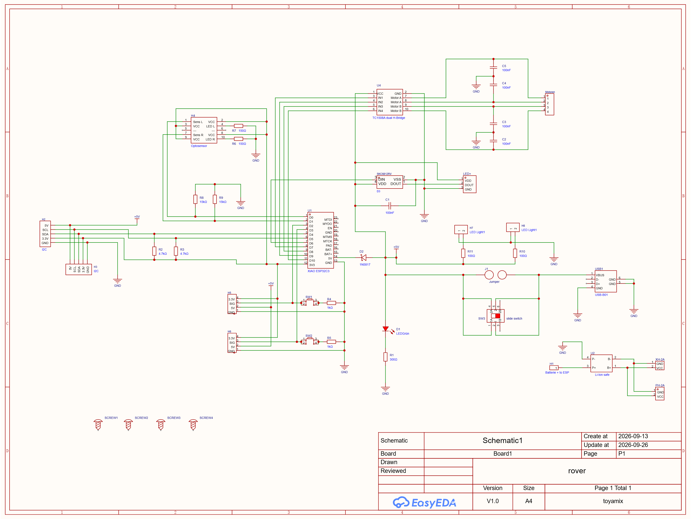

# Rover

This project aims to create a small programmable rover robot.

The rover is equipped with several sensors and components and can be used as a platform for experimenting with robotics and embedded programming.

## Sensors

* Time-of-Flight distance sensor
* Brightness sensor

## Components

* ESP32-C3
* 2 independently controlled motors
  * Forward and backward movement
* RGB LED

## Schematics and PCB Layout

The schematics and PCB layout can be found in the `hardware/` folder.
Both are made in EasyEDA Pro, a completly free software.

## Code

The code is written in MycroPython with Thonny as IDE on the Esp32-C3 board.

The rover contains code for `software/`:

* following a line
* avoiding obstacles

The code can be a starting point for writing and testing your own rover programs.
Feel free to extend the code or even write your complete own code from scretch.

Code fore testing the hardware can be found in the `software/example/` folder.

## Preview

