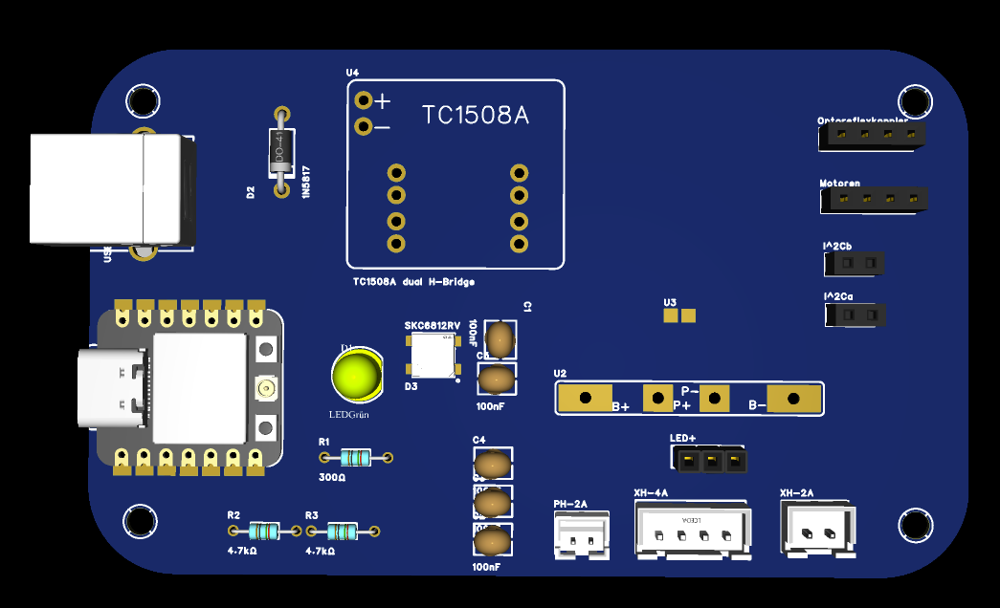

# Rover

This project aims to create a small programmable rover robot.

The rover is equipped with several sensors and components and can be used as a platform for experimenting with robotics and embedded programming.

## Sensors

* Time-of-Flight distance sensor
* Brightness sensor

## Components

* ESP32-C3
* 2 independently controlled motors
  * Forward and backward movement
* RGB LED

## Schematics and PCB Layout

The schematics and PCB layout can be found in the `hardware/` folder.

## Code

The rover includes example code for:

* Line following
* Autonomous obstacle avoidance

The code is intended to provide a starting point for writing and testing your own rover programs.

Code fore testing the hardware can be found in the `software/example/` folder.

## PCB Preview

